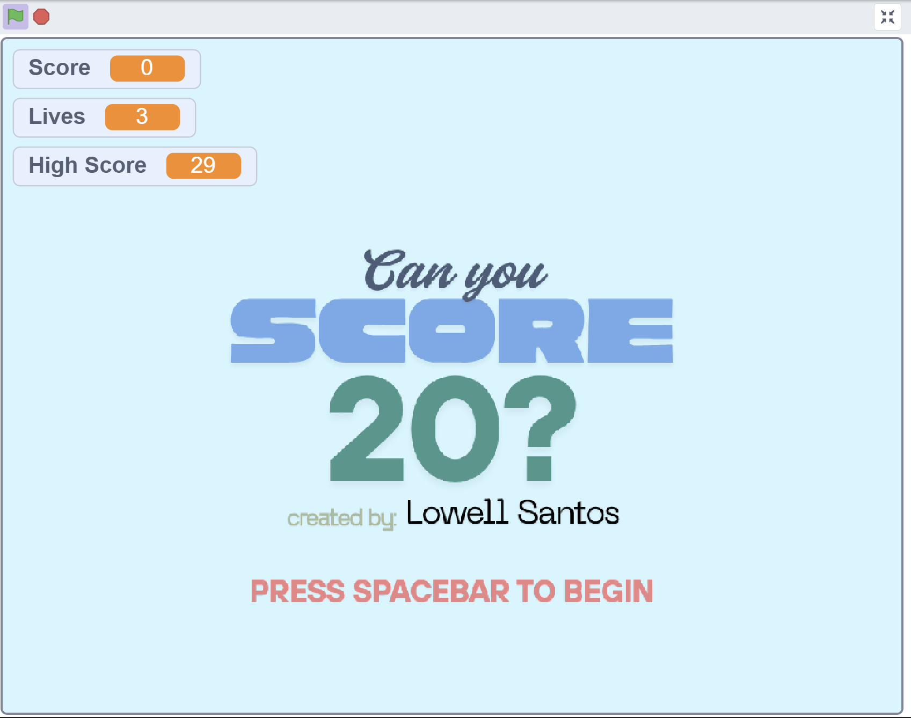

# Hi, I'm Lowell 👋

**Electronics Engineer transitioning into Software Development**  
Focused on **Full-Stack Web Development, UI/UX Engineering, and modern web applications**  
Building real-world projects using React, Node.js, and cloud databases with end-to-end functionality.

---

## 🛠 Tech Stack

### 💻 Frontend Development
- HTML, CSS, JavaScript  
- React (Vite)  
- Responsive UI Design  
- UI/UX Principles & Layout Systems  

### ⚙️ Backend Development
- Node.js, Express.js  
- REST API Development (GET, POST, PUT, DELETE)  
- PostgreSQL (Supabase)  
- Authentication & Environment Variables  

### 🧰 Tools & Workflow
- Git & GitHub  
- Canva (UI/UX Prototyping)  
- Adobe Photoshop  
- AI-assisted development (ChatGPT, Claude) for debugging, refactoring, and UI optimization  

---

## 🚀 Featured Projects

### 🌄 Hidden Ridge Food Park (Full-Stack Web App)

A full-stack restaurant reservation system with real-time database integration, admin management, and a responsive user experience.

- Built a modern React (Vite) frontend with reusable components and dynamic UI rendering  
- Developed a full CRUD reservation system with form handling and loading states  
- Implemented rate limiting to prevent spam reservations  
- Created a protected admin panel with login authentication and edit/delete capabilities  
- Integrated Supabase PostgreSQL for live data synchronization  
- Built a REST API with validation and error handling using Node.js and Express.js  
- Designed a responsive interface optimized for desktop, tablet, and mobile  
- Added UI enhancements including animations, hover effects, and smooth transitions  
- Deployed frontend on Vercel and backend on Render  

🔗 [Live Demo](https://hidden-ridge-food-park-website.vercel.app)  
🔗 [Source Code](https://github.com/SE-Looweh05/Hidden-Ridge-Food-Park-Website)

---

### 📦 Inventory Management System (Python | GUI)

Desktop inventory system for tracking stock and sales.

- Built using **Python (Tkinter)**
- Implemented full CRUD functionality
- Focused on usability and system design fundamentals

🔗 [Source Code](https://github.com/SE-Looweh05/Inventory-Management-System)

---

### 🎮 Can You Score 20? (Game Dev – CS50 Scratch)

Interactive game built with event-driven logic and progressive difficulty.

- Developed using **Scratch (Harvard CS50)**
- Strengthened logic building and problem-solving skills

🔗 [Play Demo](https://scratch.mit.edu/projects/1239081769)

---

## 📫 Contact

- 📧 Email: se.lowellsantos@gmail.com  
- 💼 LinkedIn: [Lowell Santos](https://www.linkedin.com/in/lowell-santos-11a4b02bb/)  
- 📄 Resume: Available upon request  
